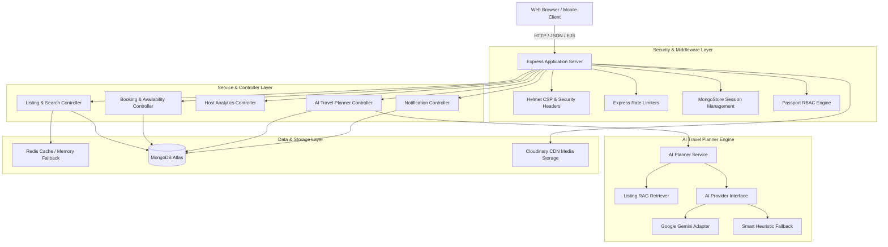

# Wanderlust • System Design & Architecture Documentation

## 1. High-Level System Architecture

Wanderlust is architected as an event-resilient, modular monolithic marketplace built on **Node.js / Express 5**, **MongoDB**, **Redis**, and an **AI Service Adapter Layer**.



---

## 2. Database Schema & Data Models

### User Model (`models/user.js`)
- **Fields**: `username`, `email` (unique, lowercase), `role` (`"user"`, `"host"`, `"admin"`), `avatar` (`{ url, filename }`), `bio`, `phone`, `isVerified`, `wishlist` (`[ObjectId -> Listing]`), `createdAt`.
- **Authentication**: `passport-local-mongoose` salted hashing.

### Listing Model (`models/listing.js`)
- **Fields**: `title`, `description`, `image` & `images` (`[{ url, filename, isCover }]`), `price`, `location`, `country`, `category` (enum), `propertyType` (enum), `roomType` (enum), `amenities` (`[String]`), `bedrooms`, `beds`, `bathrooms`, `maxGuests`, `cleaningFee`, `cancellationPolicy`, `avgRating`, `reviewCount`, `isFeatured`, `isActive`, `owner` (`ObjectId -> User`), `geometry` (`{ type: 'Point', coordinates: [lng, lat] }`), `reviews` (`[ObjectId -> Review]`).
- **Indexes**:
  - `listingSchema.index({ geometry: "2dsphere" })` — geospatial distance queries.
  - `listingSchema.index({ title: "text", description: "text", location: "text", country: "text" })` — fast search.
  - `listingSchema.index({ category: 1, price: 1, avgRating: -1 })` — compound filtering & sorting.
  - `listingSchema.index({ owner: 1, isActive: 1 })` — host management queries.

### Booking Model (`models/booking.js`)
- **Fields**: `listing` (`ObjectId -> Listing`), `guest` (`ObjectId -> User`), `host` (`ObjectId -> User`), `checkIn` (`Date`), `checkOut` (`Date`), `nights`, `guestsCount`, `basePrice`, `cleaningFee`, `serviceFee`, `taxPrice`, `totalPrice`, `status` (`"pending"`, `"confirmed"`, `"cancelled"`, `"completed"`), `paymentStatus` (`"pending"`, `"paid"`, `"refunded"`).
- **Concurrency & Overlap Check**:
  - Compound Index: `{ listing: 1, checkIn: 1, checkOut: 1, status: 1 }`
  - Atomic validation logic:
    ```javascript
    Booking.hasOverlap(listingId, checkIn, checkOut)
    ```

### Itinerary Model (`models/itinerary.js`)
- **Fields**: `user` (`ObjectId -> User`), `destination`, `days`, `budgetTier`, `interests` (`[String]`), `guests`, `title`, `summary`, `dailyPlans` (`[{ day, morning, afternoon, evening, mealRecommendations, estimatedDailyCost }]`), `recommendedListings` (`[{ listing, matchScore, whyRecommended }]`), `packingList`, `localTips`.

### Notification Model (`models/notification.js`)
- **Fields**: `recipient` (`ObjectId -> User`), `sender` (`ObjectId -> User`), `type`, `title`, `message`, `link`, `isRead`, `createdAt`.
- **Index**: `{ recipient: 1, isRead: 1, createdAt: -1 }`.

---

## 3. Modular AI Architecture & RAG Flow

The **AI Travel Planner** utilizes a modular Adapter Pattern (`AIProviderInterface`), allowing zero-downtime model switching without changing controller code:

```
[User Input: Destination, Budget, Days, Interests]
                    │
                    ▼
[RAG Engine: Query MongoDB for matching candidate Wanderlust listings]
                    │
                    ▼
       ┌────────────────────────┐
       │ Active Provider Check  │
       └───────────┬────────────┘
         Gemini Key?
        ┌──────────┴──────────┐
      Yes                    No
        ▼                     ▼
[Gemini 1.5/2.0 API]  [Smart Heuristic Adapter]
  (Structured JSON)     (Local Algorithmic RAG)
        └──────────┬──────────┘
                   │
                   ▼
[Grounded Property Matchmaker: Curate top stays & reasons]
                   │
                   ▼
[Save to MongoDB `Itinerary` + Cache in Redis + Render View]
```

---

## 4. Caching & Performance Strategy

1. **Redis with Memory Fallback**: `utils/cache.js` auto-detects Redis connection. If Redis is down or unavailable, it transparently falls back to an in-memory LRU cache with identical API semantics (`get`, `set`, `del`).
2. **Invalidation Hooks**:
   - `listings:*` keys invalidated on property create, update, delete.
   - `itinerary_cache:*` cached with 1-hour TTL.
3. **Database Projections & Pagination**: All list queries are indexed and paginated (`limit` clamped to 50 max) with `.lean()` projection where applicable.

---

## 5. Security & RBAC Matrix

| Role | Browse / Search | Book Stay | Review Property | Host Listing | View Host Dashboard | Admin Controls |
| :--- | :---: | :---: | :---: | :---: | :---: | :---: |
| **Guest / Anonymous** | ✅ | ❌ | ❌ | ❌ | ❌ | ❌ |
| **User** | ✅ | ✅ | ✅ | ❌ (prompts upgrade) | ❌ | ❌ |
| **Host** | ✅ | ✅ | ✅ | ✅ | ✅ | ❌ |
| **Admin** | ✅ | ✅ | ✅ | ✅ | ✅ | ✅ |

- **Security Middlewares**:
  - `helmet`: Protects HTTP headers and XSS.
  - `express-rate-limit`: 150 req/15min on API, 10 req/min on AI generator.
  - `cors`: Configured origin controls.
  - `connect-mongo`: Encrypted session storage in MongoDB.
